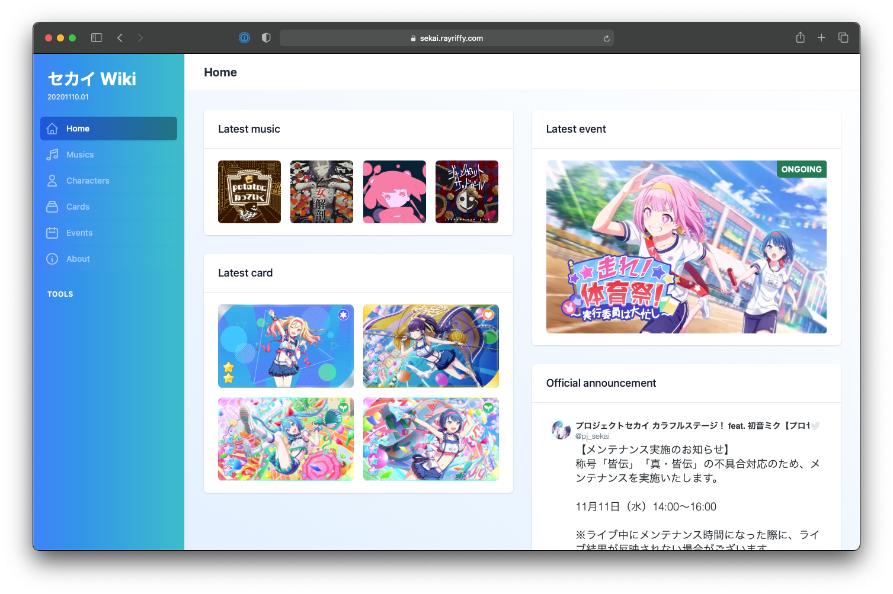

セカイ Wiki
===



Wiki page for **Project Sekai: Colorful Stage feat. Hatsune Miku**

Developing or debugging
---

Please make sure you have the following prerequisites:

- You installed the [long-term support (LTS)](https://nodejs.org/en/about/releases/) version of [Node](https://nodejs.org/en/)
- You have [yarn](https://classic.yarnpkg.com/lang/en/) installed in your machine
- When working with the codebase, we recommend using an IDE with intelligent code completion and syntax highlighting, such as [Visual Studio Code](https://code.visualstudio.com/) or [JetBrains WebStorm](https://www.jetbrains.com/webstorm/).

### Downloading the source code

```
git clone https://github.com/rayriffy/sekai-next
cd sekai-next
```

To update the source code to the latest commit, run the following command inside the `sekai-next` directory:

```
git pull
```

### Developing

We are focusing on keeping every applications and libraries to be **type-strict** as much as possible, so every file must be written in TypeScript as much as possible.

In order to spin up development server, type following command

```
yarn dev
```

### Code analysis

Every commit will be automatically formatted by **Prettier**, and we are enforcing to naming commit with [Conventional Commits](https://www.conventionalcommits.org/en/v1.0.0/) guidelines

Contributing
---

When it comes to contributing to the project, the two main things you can do to help out are reporting issues and submitting pull requests. Based on past experiences, we have prepared a [list of contributing guidelines](CONTRIBUTING.md) that should hopefully ease you into our collaboration process and answer the most frequently-asked questions.

Note that while we already have certain standards in place, nothing is set in stone. If you have an issue with the way code is structured, with any libraries we are using, or with any processes involved with contributing, *please* bring it up. We welcome all feedback so we can make contributing to this project as painless as possible.

Licence
---

All libraries and apps in this repository are licensed under the [MIT licence](https://opensource.org/licenses/MIT). Please see [the licence](LICENSE) file for more information. [tl;dr](https://tldrlegal.com/license/mit-license) you can do whatever you want as long as you include the original copyright and license notice in any copy of the software/source.
